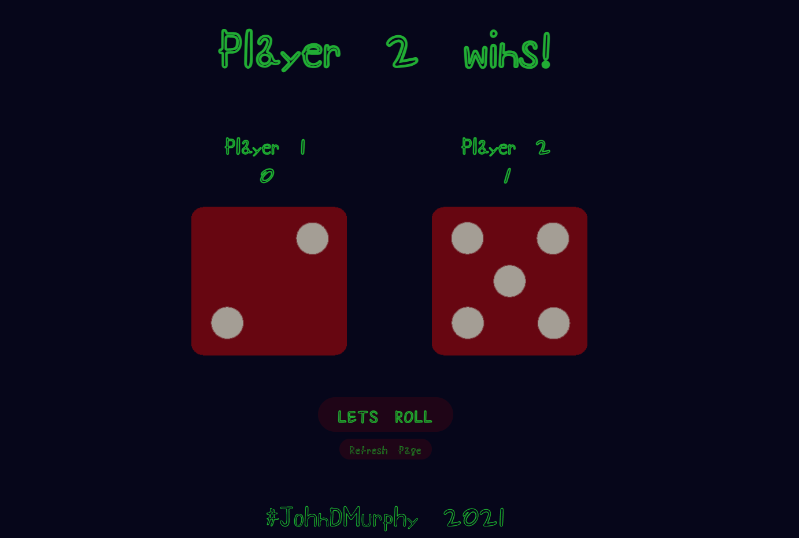

# Dice Game

> A simple dice game.

Click the button for random roll's to find the winner.

## Built With

- HTML
- CSS
- JavaScript

## Live Demo

[Live Demo Link](https://johndmurphy.github.io/dice-game/)

## Authors

👤 **Author**

- GitHub: [@githubhandle](https://github.com/JohnDMurphy)

## 🤝 Contributing

Contributions, issues, and feature requests are welcome!

Feel free to check the [issues page](https://github.com/JohnDMurphy/dice-game/issues).

## Show your support

Give a ⭐️ if you like this project!

## Acknowledgments

- Angela Yu [@Twitter](https://twitter.com/yu_angela?ref_src=twsrc%5Egoogle%7Ctwcamp%5Eserp%7Ctwgr%5Eauthor)

I took the idea for this project directly from her web devloper 2022 course and expanded on the idea

## 📝 License

This project is [MIT](MIT.md) licensed.
